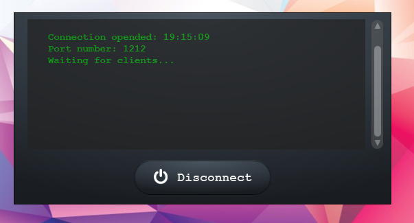

# BATTLESHIP TITANIUM 2018
> A personal project to work with Sockets and multiplayer server-client connections 


## Description

A Multiplayer Battleship game made in pure Java. with a fully functional UI made in Java FX. 

### Instructions 
* 1
    * To launch the server run the "serverDriver.java" inside control packet. 

* 2
    * To play run the "clientDriver.java" inside player packet for each player. min 2. 


```sh
this game is still in beta
```

### Future implementations
* **Fix bug when players try to reconnect to a different player**
* **limit the chat input to 100 characters**
* **Create jar files for both server and player**
* **Refractor code and allow for more flexibility**
* **Organize program in an MVC model**

